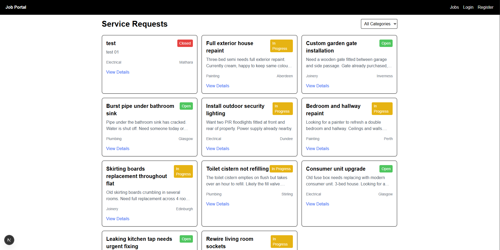
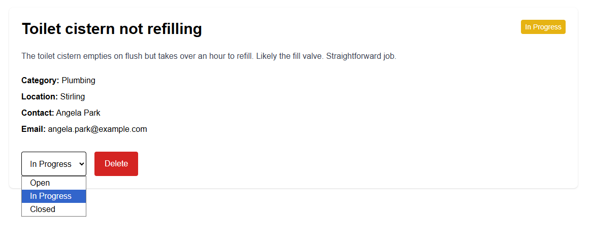
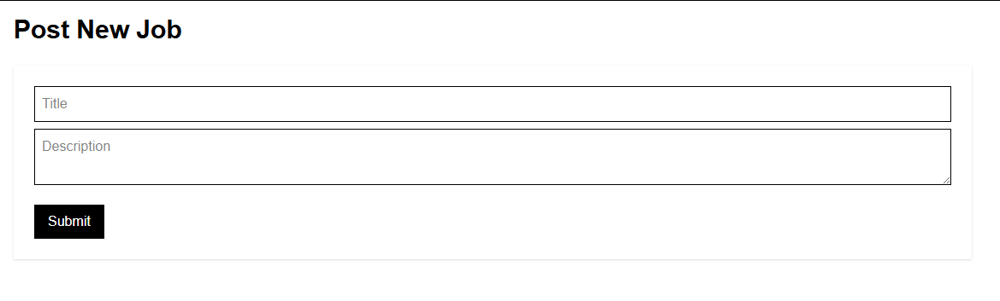
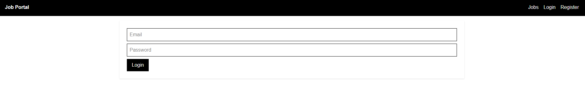
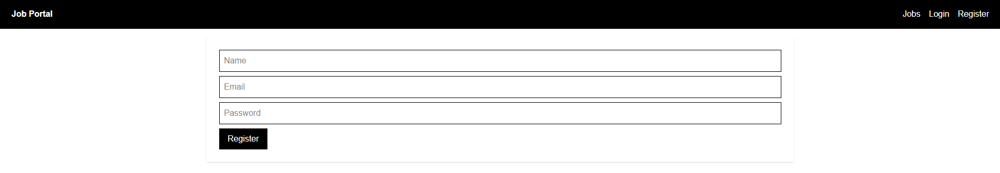

# 🖥️ Frontend

Next.js 16 frontend for the Job Portal.

---

## 📸 Screenshots

### Home — Service Requests Board


### Job Detail


### Post a New Job


### Login


### Register


---

## 🛠️ Tech Stack

| Tool            | Version  | Purpose                       |
|-----------------|----------|-------------------------------|
| Next.js         | 16.x     | React framework (App Router)  |
| React           | 19.x     | UI library                    |
| Tailwind CSS    | 4.x      | Utility-first styling         |
| Axios           | 1.x      | HTTP client for API calls     |
| TypeScript      | 5.x      | Type safety                   |

---

## 📁 Project Structure

```
frontend/
├── app/
│   ├── layout.js           # Root layout (navbar + global styles)
│   ├── page.js             # Home — service request listing + filters
│   ├── globals.css         # Global CSS
│   ├── jobs/               # Job detail page (/jobs/[id])
│   ├── create/             # Post new job form (/create)
│   ├── login/              # Login page (/login)
│   └── register/           # Register page (/register)
├── components/             # Reusable UI components
├── lib/                    # API helpers / utilities
├── public/                 # Static assets
├── next.config.ts
├── package.json
└── tsconfig.json
```

---

## ⚙️ Environment

Create a `.env.local` file in the `frontend/` directory:

```env
NEXT_PUBLIC_API_URL=http://localhost:5000
```

This points the frontend at the backend API. Change this for production.

---

## 🚀 Getting Started

```bash
# Install dependencies
npm install

# Start the development server
npm run dev
```

Open [http://localhost:3000](http://localhost:3000) in your browser. The page hot-reloads as you edit files.

```bash
# Build for production
npm run build

# Run the production build
npm start

# Lint the code
npm run lint
```

---

## 🗺️ Pages & Routes

| Route        | Description                                               | Auth Required |
|--------------|-----------------------------------------------------------|---------------|
| `/`          | Home — lists all service requests with category filter    | No            |
| `/jobs/[id]` | Job detail — full info, status updater, delete button     | Partial       |
| `/create`    | Post a new service request                                | **Yes**       |
| `/login`     | Log in to your account                                    | No            |
| `/register`  | Create a new account                                      | No            |

---

## 🔗 API Integration

The frontend communicates with the backend REST API at `http://localhost:5000` (configurable via `NEXT_PUBLIC_API_URL`).

Key API interactions:

- `GET /api/jobs` — fetch all jobs (with optional `category`, `status`, `search` query params)
- `GET /api/jobs/:id` — fetch a single job
- `POST /api/jobs` — create a job (requires JWT in `Authorization: Bearer <token>` header)
- `PATCH /api/jobs/:id` — update job status
- `DELETE /api/jobs/:id` — delete a job (requires JWT)
- `POST /api/auth/register` — register a new user
- `POST /api/auth/login` — log in and receive a JWT token

JWT tokens are stored in `localStorage` and attached to outgoing requests via Axios.

---

## 📦 Scripts

| Command         | Description                        |
|-----------------|------------------------------------|
| `npm run dev`   | Start development server           |
| `npm run build` | Build for production               |
| `npm start`     | Start production server            |
| `npm run lint`  | Run ESLint                         |

---

## 🔗 Related

- [Backend README](../backend/README.md) — API docs, auth, and test suite
- [Main README](../README.md) — Project overview and quick start
